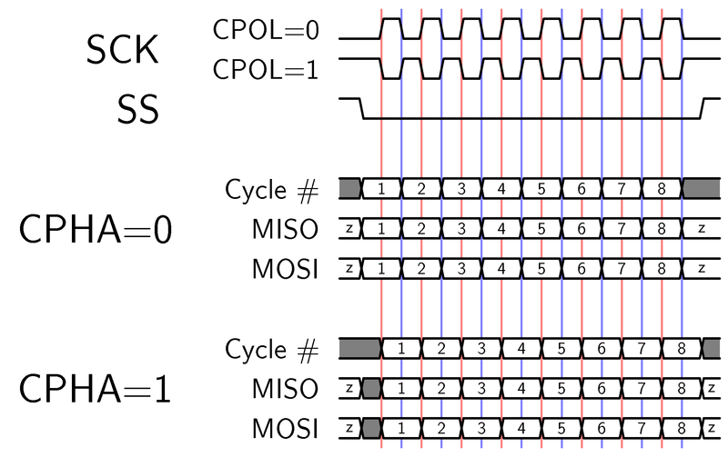
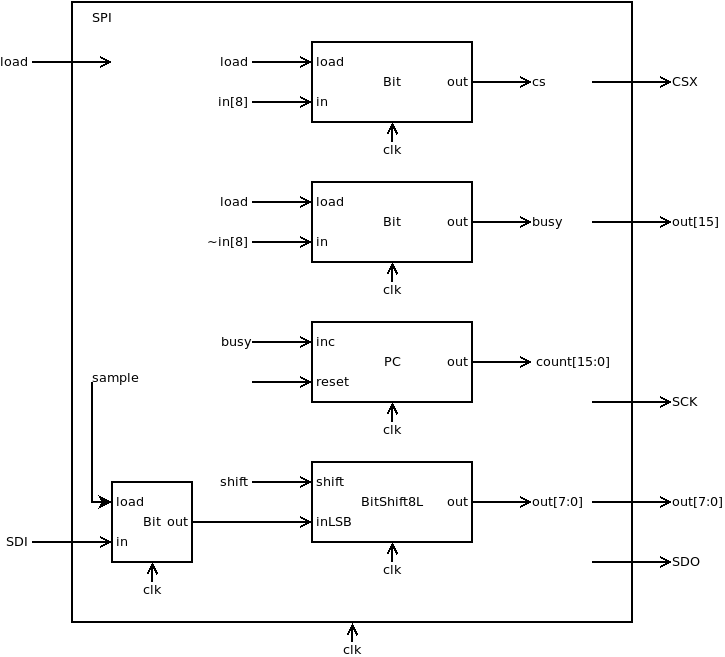
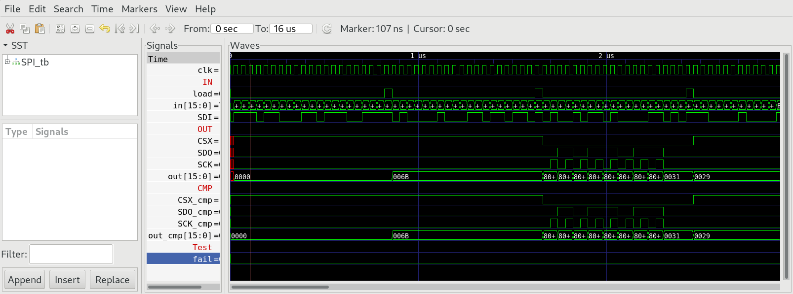
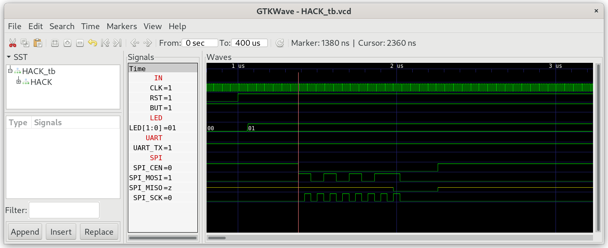
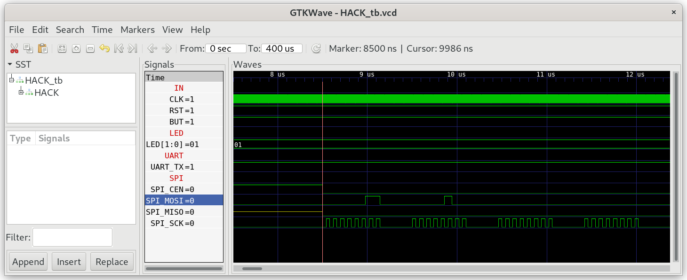
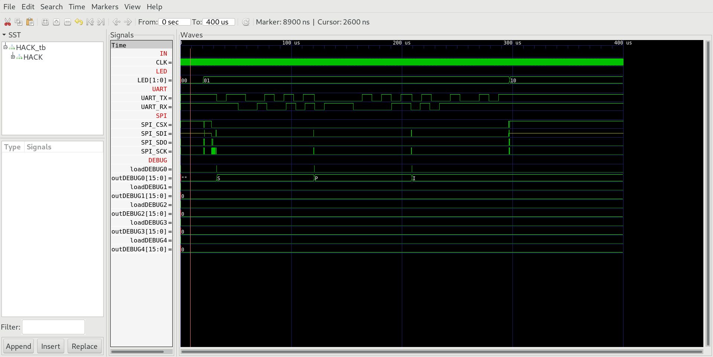

## 03 SPI

The special function register `SPI`  memory mapped to address 4100 enables HACK to read/write bytes from the spi flash memory chip W25Q16BV situated on iCE40HX1K-EVB. The timing diagramm for SPI communication looks like the following diagram (we use CPOL=0 and CPHA=0).



### Chip specification

| IN/OUT | wire     | function                                    |
| ------ | -------- | ------------------------------------------- |
| IN     | in[7:0]  | byte to be sent.                            |
| IN     | in[8]    | =1 send byte and set CSX low                |
| IN     | in[8]    | =0 pull CSX high without sending byte       |
| IN     | load     | =1 initiates the transmission, when in[8]=1 |
| OUT    | out[15]  | =0 chip is busy, =0 chip is ready           |
| OUT    | out[7:0] | received byte (when out[15]=0)              |
| OUT    | CSX      | chip select not                             |
| OUT    | SDO      | serial data out                             |
| OUT    | SCK      | serial clock                                |
| IN     | SDI      | serial data in                              |

When load=1 and in[8]=0 transmission of byte in[7:0] is initiated. CSX is goes low (and stays low even when transmission is completed). The byte is send to SDO bitwise together with 8 clock signals on SCK. At the same time the SPI receives a byte at SDI. During transmission out[15] is 1. After 16 clock cycles the transmission of one byte is completed. out[15] goes low and SPI outputs the received byte to out[7:0].

When load=1 and in[8]=1 CSX goes high without transmission of any bit.

**Attention:** Sampling of SDO is done at rising edge of SCK and shifting is done at falling edge of SCK.

### Proposed Implementation

Use a `Bit` to store the state (0 = ready, 1 = busy) which is output to out[15]. Use a counter `PC` to count from 0 to 15. Finally we need a `BitShift8L`. This will be loaded with the byte in[7:0] to be send.  Another `Bit` will sample the SDI wire when SCK=0 and shift the stored bit into the `BitShift8L` when SCK=1. After 8 bits are transmitted the module cleares out[15] and outputs the received byte to out[7:0].



### Memory map

The special function register `SPI` is mapped to memory map of HACK according to:

| address | I/O device | R/W | function                                  |
| ------- | ---------- | --- | ----------------------------------------- |
| 4100    | SPI        | R   | out[15]=1 if busy, out[7:0] received byte |
| 4100    | SPI        | W   | start transmittion of byte in[7:0]        |

### cat.asm

To test HACK with SPI we need a little machine language programm `cat.asm`, which reads 4 consecutive bytes of SPI flash memory chip W25Q16BV of iCE40HX1K-EVB, starting at address 0x040000 (256k) and sends them to UART_TX.

According to the datasheet of spi flash rom chip W25Q16BV the commands needed to read the flash rom chip are:

| command             | function                                                               |
| ------------------- | ---------------------------------------------------------------------- |
| 0xAB                | wake up from deep power down (wait 3us) before launching next command. |
| 0x03 0x04 0x00 0x00 | read data (command 0x03) starting at address 0x040000 (256k)           |
| 0xB9                | go in power down                                                       |

### SPI in real hardware

The board iCE40HX1K-EVB comes with a SPI flash rom chip W25Q16BV. The chip is already connected to iCE40HX1K according `iCE40HX1K-EVB.pcf` (Compare with schematic [iCE40HX1K_EVB](../../doc/iCE40HX1K-EVB_Rev_B.pdf).

```
set_io SPI_SDO 45 # iCE40-SDO
set_io SPI_SDI 46 # iCE40-SDI
set_io SPI_SCK 48 # iCE40-SCK
set_io SPI_CSX 49 # iCE40-SS_B
```

***

### Project

* Implement `SPI.v` and test with testbench:
  
  ```
  $ cd 03_SPI
  $ apio clean
  $ apio sim
  ```

* Compare output `OUT` of special function tregister `SPI`  with `CMP`.
  
  

* Add special function register`SPI` to `HACK.v` at memory address 4100.

* Implement `cat.asm` and test in simulation:
  
  ```
  $ cd 03_SPI
  $ make
  $ cd ../00_HACK
  $ apio clean
  $ apio sim
  ```

* Check the wake up command 0xAB:
  
  

* Check command 0x03040000 (read from address 0x040000)
  
  

* Check reading of string "SPI!" output to UartTX.
  
  

* preload the SPI memory chip with some text file at address 0x040000.

* build and upload HACK with `cat.asm` in ROM.BIN to iCE40HX1K-EVB.
  
  ```
  $ echo SPI! > spi.txt
  $ iceprogduino -o 256k -w spi.txt
  $ cd 00_HACK
  $ apio clean
  $ apio upload
  $ tio /dev/ttyACM0
  ```

* Check if you see "SPI!" in your terminal.
